# brave-api-python



面向 Brave Search 和 Brave Ask 的异步、类型安全 Python 客户端，并内置
MCP 服务器。

## 功能

- 完整或流式 AI 答案
- 多轮对话和图片输入
- Web、图片、新闻、视频和 Brave Goggles 结构化搜索
- Pydantic 类型模型、重试、代理轮换和统一异常
- stdio 或 HTTP MCP 传输

## 快速安装

```bash
uv add brave-api-python
```

## 最小示例

```python
import asyncio
from brave_api import BraveClient

async def main() -> None:
    async with BraveClient() as client:
        answer = await client.ask("什么是量子计算？")
        print(answer.text)
        result = await client.search("Python asyncio tutorial")
        for item in result.web[:3]:
            print(item.title, item.url)

asyncio.run(main())
```

所有网络操作都是异步的。请阅读[快速开始](quickstart.zh.md)、[Ask 指南](guides/ask.zh.md)、
[Search 指南](guides/search.zh.md)和[API 参考](api.zh.md)。
遇到连接、重试或生命周期问题时，请阅读[故障排查](guides/troubleshooting.zh.md)。
